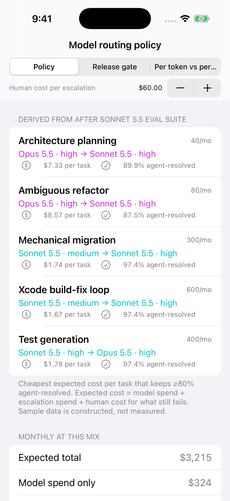
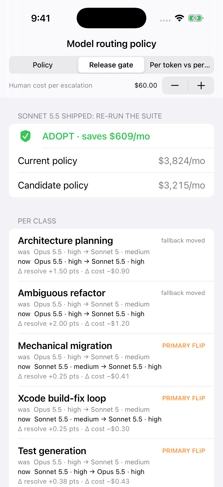
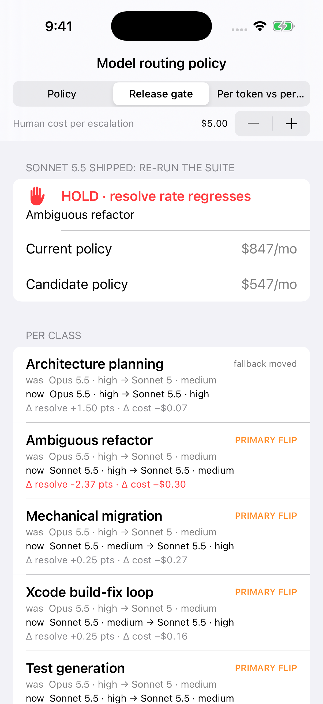
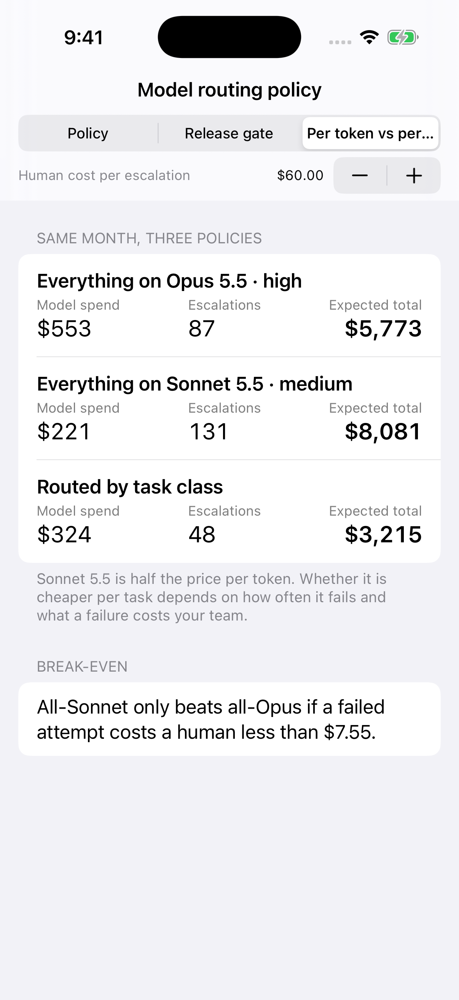

# model-routing-policy-article-demo

**Which model should our coding agent use?** is the wrong question. This repo is a small Swift library and iOS demo for the right one: *which model, at which effort, for which class of task, and what evidence would change that answer?*

Article: [Half the Price per Token, 40% More per Month: Your Coding Agent Needs a Model-Routing Policy](https://medium.com/@er.rajatlakhina/half-the-price-per-token-40-more-per-month-your-coding-agent-needs-a-model-routing-policy-6abe2edb4428) (Medium)



## What it shows

Sonnet 5.5 shipped on 28 Sep 2026 at **half Opus 5.5's list price per token** ($2/$10 vs $4/$20 per million input/output tokens). The demo shows why "half the price per token" does not mean "half the cost per task":

| Policy (sample month, $60 per human escalation) | Model spend | Escalations | Expected total |
|---|---:|---:|---:|
| Everything on Opus 5.5 · high | $553 | 87 | $5,773 |
| Everything on Sonnet 5.5 · medium | $221 | 131 | $8,081 |
| **Routed by task class** | **$324** | **48** | **$3,215** |

All-Sonnet only beats all-Opus if a failed agent attempt costs a human less than **$7.55**.

> **The numbers are constructed sample data, not benchmarks.** `SampleTeam.swift` holds 20-task eval rows shaped like a team's own suite, so every figure above can be recomputed from code. Plug in your own runs.

## The pieces

- **`EvalResult` / `EvalSuite`**: one row per (model, effort, task class): attempts, resolved, average tokens per attempt. `costPerResolved` is `nil` when nothing resolved, because "infinite" is the honest answer.
- **`Assumptions`**: the numbers a lead has to write down: human cost per escalation, how much harder a task is once the first model failed (`fallbackHardnessDiscount`), and the resolve-rate floor no route may go under.
- **`Economics.price(_:for:in:assumptions:)`**: expected cost of a route = primary spend + fallback spend when it fires + human cost for what still fails. Unmeasured routes are not priced at all.
- **`PolicyBuilder.derive`**: per task class, the cheapest route that clears the floor. Effort is pinned per class (`ModelChoice` = model + effort).
- **`ReleaseGate.evaluate`**: re-derives the policy when a model ships, diffs it class by class, and returns `.adopt(monthlySaving:)` or `.hold(regressions:)` if any class would lose more than 2 points of agent-resolve rate to save money.
- **`Sensitivity.breakEvenEscalationCost`**: the escalation cost at which two policies cost the same.

```swift
let report = ReleaseGate.evaluate(current: SampleTeam.beforeRelease,
                                  candidate: SampleTeam.afterRelease,
                                  mix: SampleTeam.monthlyMix)
// .adopt(monthlySaving: 609.16): 3 of 5 classes move their primary to Sonnet 5.5;
// architecture planning and ambiguous refactors stay on Opus 5.5.

let cheapHumans = Assumptions(humanEscalationCost: 5)
ReleaseGate.evaluate(current: SampleTeam.beforeRelease, candidate: SampleTeam.afterRelease,
                     mix: SampleTeam.monthlyMix, assumptions: cheapHumans).verdict
// .hold(regressions: [.ambiguousRefactor]): refactors would lose 2.375 points of resolve rate
```

## Screenshots (real, from the iOS Simulator in CI)

| Policy | Release gate (adopt) | Release gate at $5/escalation (hold) | Per token vs per task |
|---|---|---|---|
|  |  |  |  |

## How to run it

```bash
git clone https://github.com/rajatslakhina/model-routing-policy-article-demo.git
cd model-routing-policy-article-demo
open Demo.xcodeproj
```

Pick the **Demo** scheme and any iPhone Simulator, then Build & Run. No other setup: the app uses the library through a local package reference (`XCLocalSwiftPackageReference "."`). The stepper at the top changes the human cost per escalation and every tab recomputes.

Library only:

```bash
swift build
swift test
```

## Verification status

- `swift build -Xswiftc -warnings-as-errors` and `swift test` (20 XCTest cases, including ones that pin every headline number in the article) pass on Swift 6.1.2 (Linux) and in CI on `macos-15`.
- The Simulator screenshots above are taken by `.github/workflows/ci.yml`: it builds `Demo.xcodeproj` with `xcodebuild`, installs the app on an iPhone Simulator, launches it once per tab with launch arguments, checks the process is still alive after 8 seconds, and commits the PNGs. That is a real build and launch, but nobody tapped the UI by hand.

## Sources

- Anthropic, [Introducing Claude Sonnet 5.5](https://www.anthropic.com/claude-sonnet-5-5) (28 Sep 2026)
- Anthropic, [API pricing](https://platform.claude.com/docs/en/about-claude/pricing)
- The New Stack, [Claude Sonnet 5.5 launch](https://thenewstack.io/claude-sonnet-55-launch/)

MIT License.
